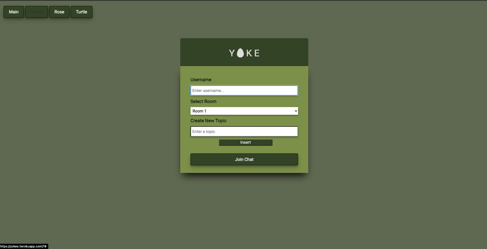
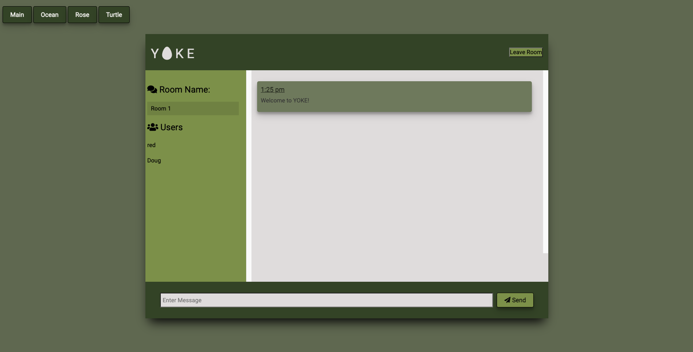

<h1 align="center">Project 2: Team Yoke</h1>

## Yoke

- [Description](#description)
- [Installation](#installation)
- [Usage](#usage)
- [Contributing](#contributing)

## Description

Yoke is an online messaging tool, that allows users to join/add a chatroom and have realtime conversations with other users online. Core technology includes Moment.js, Socket.io, Bootstrap, Express, Sequelize-MySQL, Heroku/JawsDB & Handlebars.

Screenshot of the completed output:

## Installation

`npm i`

## Usage

Run the following command at the root of the directory and you will be able to view the local website at http://localhost:3000/:

`node server`

The project was deployed on heroku and can viewed at this website:

`https://yokee.herokuapp.com/`

## Contributing

:octocat: [Dillon Vora](https://github.com/dvorav)
:octocat: [Benito Gonzalez](https://github.com/ohnobenito)
:octocat: [Kelsey Lyngdal](https://github.com/klyngdal)
:octocat: [Vina Kurniasari](https://github.com/vina19)
:octocat: [Doug Kvamme](https://github.com/kvadou)

 
